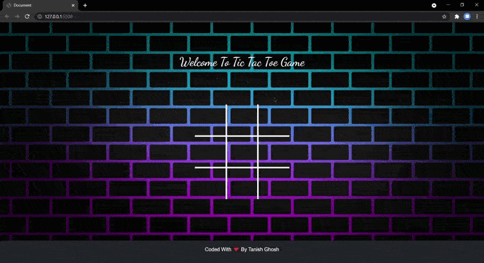
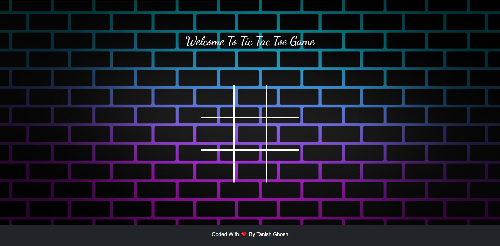

# Project Title

Multiplayer Tic Tac Toe Game Using HTML + CSS + JS + BootStrap

## Documentation

## Array Explanation

**let record = [ ] :** This Array Stores The Symbol. So, That On The Next Click Another Symbol Could Be Used.

**let div = [ ] :**  This Array Stores The Id Of The Div. So, that It Could Cross-Check Whether The User Has Clicked The Div Multiple Times. It Prevents The User From Inserting Multiple Elements In To A Single Div.

**let chances = [ ] :** This Array Is Used Within The win(n) function. So, That It Could Change The Background Color Of Div If Any Condition Is True.

**let position = ['', '', '', '', '', '', '', '', ''] :** This Array Is Used To Store Symbol By Replacing Blank Elements At Specific Indexes. This Is The Main Array On Which Conditionals Will Be Applied.

## Functions Explanation

**function cross(){} :** This Function Is Used To Insert The 'X' Symbol Into The Board.

**function circle(){} :** This Function Is Used To Insert The 'o' Symbol Into The Board.

**function func(id) {} :** This Function Is The Main Function Which Will Work On User's Click. It Will Insert Symbols In The Div If The chance Variable Value Is Less Than 9.

**function win(n) {} :** This Function Is Used To Check If The Condition Is True Or False. It Also Updates The chances Array Accordingly.

**function clear() {) :** This Function Is Used To Reset The The Tic Tac Toe Board To Normal.

**function winnerName() {} :** This Function Is Used To Write The Winner or Draw On The DOM. After That It Takes The Help Of Clear Function To Reset It.

## Variable Explanation
**let chance = 0 :** This Variable Is Created To Count The No Of Clicks And To Prevent More Than 9 Clicks.

**let winner = document.getElementById('winner') :** This Variable Is Used So That We Can Dynamically Insert The Result Of The Game Into The DOM.

**let content = <HTML content> :** This Variable Is Used To Reset The Game Board By Inserting The HTML content After Clearing The HTML Content Of 

 and Vice- Versa.
## Demo

## Screenshots

  